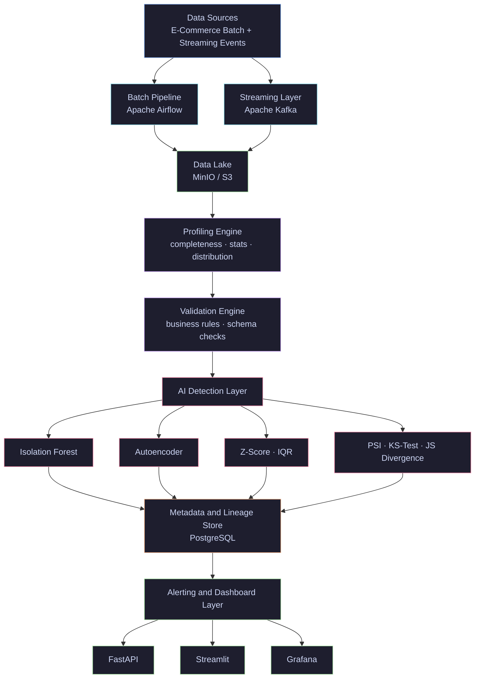

<div align="center">

# SentinelFlow

### AI-Powered Hybrid Data Observability Platform

Production-grade pipeline monitoring combining batch ETL, real-time streaming,
ML-based anomaly detection, and drift monitoring to ensure data reliability at scale.


</div>

---

## Overview

SentinelFlow is a production-inspired data observability platform built to monitor
the health, quality, and reliability of data pipelines.

Modern data teams face silent failures — missing values, schema changes, distribution
shifts, and corrupted records — that traditional infrastructure monitoring completely
misses. SentinelFlow addresses this by placing an AI-powered observability layer
directly on top of the data itself.

---
## Architecture

## Features

### Data Quality Monitoring
- Detects missing values, duplicates, invalid formats, out-of-range values
- Schema change detection — new columns, dropped columns, type changes
- Freshness monitoring for late data arrivals
- Business rule validation per dataset

### AI Anomaly Detection
- Isolation Forest — unsupervised detection of abnormal records
- Autoencoder — deep learning reconstruction error detection
- Z-Score — standard deviation based detection
- IQR — interquartile range based detection
- Real-time streaming anomaly detection via Kafka

### Data Drift Detection
- PSI (Population Stability Index) — distribution shift measurement
- KS-Test (Kolmogorov-Smirnov) — statistical distribution comparison
- Jensen-Shannon Divergence — distribution similarity scoring

### Hybrid Pipeline
- Batch — daily ETL via Apache Airflow with two DAGs
- Streaming — real-time event processing via Apache Kafka

### Data Lake
- MinIO S3-compatible storage for raw data and model artifacts
- Organized into raw, processed, and models layers

### Metadata and Lineage
- Full pipeline traceability from source to dashboard
- Quality score history per dataset per run
- Downstream impact visibility

### Alerting
- Email alerts for threshold breaches
- Slack webhook notifications
- Dashboard real-time notifications
- Alert history with severity levels

---

## Services
---

| Service | URL | Credentials |
|---|---|---|
| Streamlit Dashboard | http://localhost:8501 | none |
| Grafana | http://localhost:3000 | admin / sentinelflow123 |
| FastAPI Docs | http://localhost:8000/docs | none |
| Airflow | http://localhost:8080 | admin / admin |
| MinIO Console | http://localhost:9001 | see .env |
| PostgreSQL | localhost:5433 | see .env |
| Kafka | localhost:9092 | none |

---

## Project Structure

```
sentinelflow/
├── config/                        # Settings and logging
├── data/
│   ├── raw/                       # Generated raw datasets
│   ├── processed/                 # Processed datasets
│   ├── samples/                   # Clean datasets for model training
│   └── streaming/                 # Streaming data
├── ingestion/
│   ├── batch/                     # Data generation and batch loading
│   └── streaming/                 # Kafka producer and consumer
├── profiling/                     # Data profiling engine
├── validation/                    # Business rule validation and schema checking
├── detection/
│   ├── isolation_forest/          # Isolation Forest model
│   ├── autoencoder/               # Autoencoder deep learning model
│   ├── statistical/               # Z-Score and IQR detection
│   └── drift/                     # PSI, KS-Test, JS Divergence
├── storage/                       # MinIO data lake client
├── metadata/                      # Pipeline metadata and lineage tracking
├── alerting/                      # Email, Slack, and database alerts
├── api/                           # FastAPI REST API
│   └── routes/                    # Quality, anomalies, drift, metadata endpoints
├── dashboard/
│   ├── app.py                     # Streamlit main application
│   └── components/                # Overview, quality, anomalies, drift pages
├── airflow/
│   └── dags/                      # Batch pipeline and quality check DAGs
├── kafka_config/                  # Kafka topic configuration
├── models/                        # Trained model artifacts (gitignored)
├── tests/
│   ├── unit/                      # 32 unit tests
│   └── integration/               # Integration tests
├── scripts/                       # Setup, seed, and pipeline runner
├── docker/                        # Dockerfiles and Grafana provisioning
├── .github/workflows/             # CI/CD pipeline
├── docker-compose.yml             # Full stack orchestration
├── requirements.txt               # Python dependencies
└── .env.example                   # Environment variable template
```

## Quick Start

### Prerequisites
- Docker Desktop
- Python 3.11
- Git

### 1. Clone the repository
```bash
git clone https://github.com/YOUR_USERNAME/sentinelflow.git
cd sentinelflow
```

### 2. Set up environment
```bash
cp .env.example .env
# Edit .env with your credentials
```

### 3. Create virtual environment
```bash
python -m venv venv
venv\Scripts\activate        # Windows
source venv/bin/activate     # Mac/Linux
pip install -r requirements.txt
```

### 4. Start all services
```bash
# First time only
docker-compose up airflow-init

# Every time
docker-compose up -d postgres kafka minio grafana airflow-webserver airflow-scheduler
```

### 5. Initialize the database
```bash
python -m scripts.setup_db
```

### 6. Seed initial data
```bash
python -m scripts.seed_data
```

### 7. Run the full pipeline
```bash
python -m scripts.run_pipeline
```

### 8. Launch the dashboard
```bash
streamlit run dashboard/app.py
```

### 9. Launch the API
```bash
uvicorn api.main:app --reload
```

---

## API Endpoints

| Method | Endpoint | Description |
|---|---|---|
| GET | /quality/profiling/{dataset} | Profiling results per column |
| GET | /quality/validation/{dataset} | Validation results |
| GET | /quality/summary | Quality summary all datasets |
| GET | /anomalies/{dataset} | Anomaly detection results |
| GET | /anomalies/summary/all | Anomaly summary all methods |
| GET | /drift/{dataset} | Drift detection results |
| GET | /drift/summary/all | Drift summary all datasets |
| GET | /metadata/health | Platform health score |
| GET | /metadata/pipelines | Pipeline run history |
| GET | /metadata/lineage/{pipeline_id} | Full lineage chain |
| GET | /metadata/alerts | Active alerts |
| GET | /health | API health check |

---

## Tech Stack

| Layer | Technology |
|---|---|
| Batch Orchestration | Apache Airflow 2.8 |
| Streaming | Apache Kafka 3.6 (KRaft mode) |
| Data Lake | MinIO (S3-compatible) |
| Data Validation | Custom validation engine |
| Anomaly Detection | Scikit-learn, TensorFlow |
| Drift Detection | SciPy, NumPy |
| Storage | PostgreSQL 15 |
| API | FastAPI |
| Dashboard | Streamlit + Plotly |
| Monitoring | Grafana 10.2 |
| Containerization | Docker + Docker Compose |
| CI/CD | GitHub Actions |
| Language | Python 3.11 |

---

## Running Tests

```bash
# Unit tests
pytest tests/unit/ -v

# With coverage
pytest tests/unit/ --cov=profiling --cov=validation --cov=detection -v

# Integration tests (requires running services)
pytest tests/integration/ -v
```

---

## Airflow DAGs

| DAG | Schedule | Description |
|---|---|---|
| sentinelflow_batch_pipeline | Daily at midnight | Full pipeline: generation, profiling, validation, anomaly detection, drift, alerts |
| sentinelflow_quality_check | Every hour | Lightweight: profiling, validation, alerts |

---

## License

MIT License. See  LICENSE for the  details.

---


<div align="center">
Built by wissem ben khalifa — Data Engineering Portfolio Project
</div>
